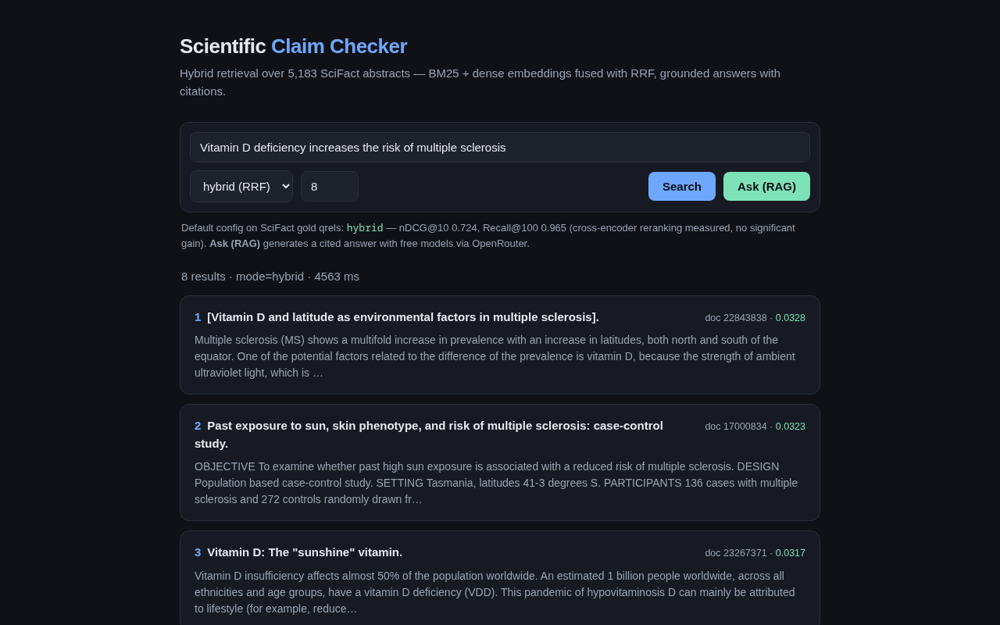

# Semantic Search with RAG Engine

[](https://github.com/areebfazli/rag_search/actions/workflows/ci.yml)

Hybrid retrieval (**BM25 + dense embeddings**, fused with Reciprocal Rank Fusion) and grounded
**RAG** answers, with an evaluation harness that measures every stage on **gold relevance
labels** and paired significance tests, including two cross-encoder rerankers that, measured,
did not earn their place in the pipeline.



## Results at a glance

BEIR/SciFact, 300 test queries, gold qrels. Bold is best per column.

| Config | nDCG@10 | Recall@100 |
|---|---|---|
| BM25 | 0.6863 | 0.9127 |
| Dense (bge-small) | 0.7127 | 0.9417 |
| **Hybrid (RRF)**, default | 0.7241 | **0.9650** |
| Hybrid + rerank (MS-MARCO MiniLM) | 0.6975 | **0.9650** |
| Hybrid + rerank (bge-reranker-base) | **0.7242** | **0.9650** |

MRR@10, MAP@100 and the per-comparison significance tests are in
[`eval/results/retrieval.md`](eval/results/retrieval.md); what the numbers mean is in
[Findings](#evaluation-headline-artifact) below.

## Pipeline

```
query ─┬─► BM25 (bm25s)      top-100 ─┐
       └─► dense (Qdrant)    top-100 ─┴─► RRF fusion ─► top-8 ──► search results
                                              │
                        context + grounded prompt ─► LLM ─► answer + [n] citations

optional 2nd stage: cross-encoder rerank over the top-32 fused candidates.
Measured below, and on this corpus it does not improve ranking, so it is off by default.
```

## Stack

| Layer | Tool |
|---|---|
| Embeddings | `BAAI/bge-small-en-v1.5` |
| Lexical | `bm25s` |
| Fusion | Reciprocal Rank Fusion (hand-rolled) |
| Vector store | Qdrant (embedded local mode) |
| Reranker | `cross-encoder/ms-marco-MiniLM-L-6-v2` and `BAAI/bge-reranker-base` (both evaluated; swappable via `SSR_RERANKER_MODEL`) |
| API | FastAPI + slowapi rate limiting |
| Retrieval eval | `ranx` on BEIR/SciFact gold qrels, with paired significance tests |
| RAG eval | Verdicts + abstention scored against SciFact rationale labels; free Nemotron 3 Ultra judge for faithfulness, with a judge-consistency harness (`app/eval/rag_eval.py`, `app/eval/judge_agreement.py`) |
| LLM | OpenRouter free models by default ($0): `inclusionai/ling-3.0-flash-sante:free` (Ling 3.0 Flash Sante) generator and `nvidia/nemotron-3-ultra-550b-a55b:free` (Nemotron 3 Ultra) judge, from different model families so the generator never grades its own output. Paid `openai/gpt-oss-120b` is an optional generator override via `SSR_OPENROUTER_LLM_MODEL` (pinned to a bf16 provider, no fallbacks, price-capped; [`app/core/llm_endpoints.py`](app/core/llm_endpoints.py)). Groq, Ollama or any OpenAI-compatible endpoint via `SSR_LLM_PROVIDER=groq` + `SSR_LLM_BASE_URL` |

## Evaluation (headline artifact)

Measured on BEIR/SciFact: 300 test queries, gold relevance judgments (`make eval`; the table is
[above](#results-at-a-glance)). Point estimates invite over-reading, so every claim below is
backed by a **paired two-sided t-test on per-query nDCG@10** (300 pairs), reported as Δ, p, and
per-query win/tie/loss. The full per-comparison table is committed in
[`eval/results/retrieval.md`](eval/results/retrieval.md#significance), and the label-stratified
re-score behind Finding 1 in [`eval/results/analysis.md`](eval/results/analysis.md).

Six tests are reported here (the five in that significance table plus Recall@100 in Finding 1),
and none are corrected for multiple comparisons. Bonferroni at α = 0.05 would set the bar at
p ≈ 0.008, which only hybrid-vs-BM25 clears, so treat the two results at p ≈ 0.035–0.038 as
suggestive. The load-bearing conclusions below are the *null* ones, which correction only
strengthens; p = 0.996 is not a near-miss.

**Findings.**

**1. Fusion's win is recall, not ranking.** Hybrid RRF beats BM25 by +0.038 nDCG@10
(p = 0.0007), but its +0.011 edge over *dense alone* is not significant (p = 0.26, W/T/L
53/213/34). Where fusion does separate from dense is **Recall@100: 0.942 → 0.965 (p = 0.035,
W/T/L 9/289/2)**, and that, not top-10 ordering, is the reason to keep it: a fuller candidate
pool for the stages downstream. On 11 discordant queries out of 300, that is the right call on
this evidence rather than a settled one.[^rrf]

Stratified by SciFact's claim labels ([`eval/results/analysis.md`](eval/results/analysis.md)),
that recall gain is **entirely on NEI claims**, the 112 of 300 where annotators found no rationale
in any abstract but BEIR's qrels still mark the cited one relevant. All 11 discordant queries are
NEI: hybrid gains +0.0625 Recall@100 there (p = 0.034, W/T/L 9/101/2). On the 188
evidence-bearing (SUPPORT/CONTRADICT) claims, hybrid and dense are identical at Recall@100 on
every query (0.9947 against rationale docs), and nDCG@10 differs by +0.0003 (p = 0.977). So the
fuller pool is fuller in abstracts that carry no evidence: fusion does not retrieve more
supporting or refuting evidence than dense alone on this corpus.

**2. Neither cross-encoder reranker paid off.** The CPU-default MS-MARCO MiniLM, trained on
short web queries, *costs* 0.027 nDCG@10 against plain hybrid (p = 0.056, W/T/L 45/192/63). The
domain-appropriate `bge-reranker-base` repairs exactly that damage, beating MiniLM by the same
0.027 (p = 0.038), and then lands on top of doing nothing at all: **Δ = +0.0001, p = 0.996**.

**3. So the reranker *choice* matters and reranking itself doesn't.** A mismatched cross-encoder
degrades ranking; the right one returns you to where you started, expensively. On a 4-core
laptop CPU, reranking a 32-candidate slice costs **3.94 s/query (MiniLM)** and **23.4 s/query
(bge)** against 0.124 s/query for hybrid alone: ≈188× the latency for a statistical tie (MiniLM
≈32×). Those are per-query means of `SearchService.retrieve` after 3 warm-ups on an Intel
i5-10210U with torch pinned to 4 threads, hybrid over all 300 queries and rerank over a seeded
40-query sample ([`eval/results/latency.md`](eval/results/latency.md)); earlier figures here were
console readings from the eval sweep and ran higher. **Hybrid RRF is the default**; reranking
stays available behind `mode=hybrid_rerank`.

This replaces an earlier claim in this README, that reranking "only pays off with a
domain-appropriate model such as bge-reranker", which was never run. Measured, it is wrong: the
domain-appropriate model doesn't pay off either, it just stops the mismatched one from hurting.

Bounding the reranked slice to 32 (a latency guard, see [Operational notes](#operational-notes))
also caps the damage a bad reranker can do: MiniLM scored 0.6715 reordering all 100 fused
candidates versus 0.6975 over 32, having fewer chances to promote a bad document into the top
10.[^depth]

[^rrf]: RRF is insensitive to its k on this data: for k ∈ {1, 2, 5, 10, 20, 100}, nDCG@10 moves
by at most 0.0046 against the default k = 60 (all p ≥ 0.19), and Recall@100 stays at 0.965 on
every query. No fusion of these two pools could raise it much: only 3 of the 11 misses are in
either retriever's top-100, a ceiling of 0.975. Weighting dense at 0.3 or 0.7 instead of equally
gains no significant nDCG@10 (-0.0096, p = 0.18; +0.0034, p = 0.50) and costs recall: 0.928 at
0.3 dense (p = 0.002), 0.952 at 0.7 (p = 0.16). The numbers are an offline replay of the cached
top-100 lists, verified to reproduce the committed hybrid run exactly, in §4 of
[`eval/results/analysis.md`](eval/results/analysis.md#4-rrf-sensitivity-offline-replay).

[^depth]: A point estimate from the previous committed run at full depth (same model, corpus and
fusion, with the BM25/dense/hybrid rows bit-identical), not a row in the current table. Reproduce
with `SSR_RERANK_CANDIDATES=100 uv run python -m app.eval.retrieval_eval`.

## Grounded answers (RAG)

`GET /answer?q=...` runs the hybrid retrieval, then generates a grounded answer with an OpenAI-compatible LLM (the free `inclusionai/ling-3.0-flash-sante:free` on OpenRouter by default; paid `openai/gpt-oss-120b` via `SSR_OPENROUTER_LLM_MODEL`, or Groq, Ollama or another endpoint via `SSR_LLM_PROVIDER=groq` and `SSR_LLM_BASE_URL`). Answers cite sources as `[n]` mapped back to document ids, and the model is instructed to **abstain when the retrieved context lacks the evidence** rather than hallucinate.

For example, `/answer?q=Can aspirin reduce the risk of colorectal cancer?`:
> "Aspirin has been shown to reduce the risk of colorectal cancer [1][2][3] … a pooled analysis of four randomized trials showed a 34% reduction in 20-year colorectal cancer mortality [3]."

**Answer-quality eval** (`app/eval/rag_eval.py`) scores each answer's final `Verdict:` line
(supported / refuted / not enough evidence) and its answer/abstain decision **against SciFact's
labels rather than assuming them correct**; an LLM judge scores only faithfulness and context
relevance. Generator = Ling 3.0 Flash Sante (`inclusionai/ling-3.0-flash-sante:free`), a free
health/medicine-tuned model on OpenRouter, with a 2048-token budget and one retry at 2x on
`finish_reason=length`. Judge = Nemotron 3 Ultra (`nvidia/nemotron-3-ultra-550b-a55b:free`), a
different model family, so the generator isn't grading its own output. It was picked from a bench
of 10 free OpenRouter models because the previous judge's free variant (`qwen/qwen3.8-27b:free`)
served 0 of 4 calls (upstream 429s), while Nemotron served 22 of 22 and matched the previous judge
on answered rows. **All 300 SciFact test claims** (in seeded order, seed 13, so the first 50 are
the earlier 50-claim sample), all 300 scored and 0 skipped, top-5 context; full tables in
[`eval/results/rag.md`](eval/results/rag.md). **A full run costs $0 on the default free models**
(OpenRouter reported $0.00 for the committed run). The run spanned two days: it hit OpenRouter's
free-tier cap of 1,000 requests/day (account-wide) partway through and resumed from its per-row
checkpoint the next day, and 2 claims that had received empty provider responses were
retried after the fix in commit 481e623 (retry an empty completion instead of skipping the claim).

**Verdict accuracy is 0.7767 (233 of 300), 95% Wilson CI 0.726–0.820.** Per label: SUPPORT 0.774
(96 of 124), CONTRADICT 0.859 (55 of 64), NEI 0.732 (82 of 112).

**What changed (0.73 → 0.78).** Same 300 stored Ling answers, zero new LLM calls: a
verdict-recovery parser — developed and frozen on 100 SciFact *train* claims, then applied as-is
to the test answers — reads a verdict restated in the prose when the final `Verdict:` line is
missing (inline recovery), or falls back to a stance-inference rule. Paired exact McNemar against
the previous committed run (`make rag-compare`): verdict correctness moves 14 claims from wrong to
right and 0 from right to wrong (p ≈ 0.0001); abstention (+0.01, p = 0.25) and citation rate
(+0.00, p = 1.00) don't move, as expected since the underlying answers are unchanged.

Abstention is scored against a **rationale oracle**: the context has evidence when a document the
annotators cited *with rationale sentences* is in the top-5. NEI claims have no rationale
document, so abstaining on them is the correct action.

| Metric | Score |
|---|---|
| Faithfulness (over answered, LLM judge) | 0.98 |
| Context relevance (all, LLM judge) | 0.72 |
| **3-class verdict accuracy** (vs gold label, no judge) | **0.78** (0.7767; 95% CI 0.726–0.820) |
| Verdict line parsed (incl. recovered) | 0.95 |
| Truncated answers (hit the token budget after 1 retry) | 11 of 300 |
| Answers that needed the retry | 63 of 300 |
| Replies citing at least one passage | 282 of 300 |
| Bare `Verdict:`-only replies | 0 of 300 |
| Evidence retrieved (rationale doc in top-5) | 0.58 |
| Answered (model attempted an answer) | 0.64 |
| **Abstention precision** (abstained & no evidence) | **0.81** |
| Abstention recall (no evidence & abstained) | 0.70 |
| False abstention (had evidence, abstained anyway) | 0.12 |
| Answered without evidence, as a share of answers given (hallucination risk) | 0.20 |

|  | evidence retrieved (175) | no evidence (125) |
|---|---|---|
| **answered** (192) | 154 answered with evidence | 38 answered with nothing to go on |
| **abstained** (108) | 21 declined despite having the evidence | 87 correct |

Verdicts against the gold label (`NONE` = answered with no parseable/recoverable verdict line,
always wrong):

| Gold \ predicted | SUPPORT | CONTRADICT | NEI | NONE |
|---|---|---|---|---|
| **SUPPORT** (124) | 96 | 6 | 19 | 3 |
| **CONTRADICT** (64) | 1 | 55 | 7 | 1 |
| **NEI** (112) | 17 | 13 | 82 | 0 |

**Paired comparisons with the earlier runs.** The sample nests, so the first 50 of these 300
claims are exactly the claims both earlier 50-claim runs scored, with the same retrieval,
generator prompt, judge model, judge prompt and scoring: the previous committed Ling run (commit
1bcdb33, run at c91d5dc) and the paid `openai/gpt-oss-120b` run before it (commit 9e6b2ea, run at
133e9c7, 1024-token budget). `make rag-compare` pairs them claim by claim with an exact two-sided
McNemar test (b = earlier run right and this run wrong, c = the reverse). **These numbers all
predate the verdict-recovery parser** — they're scored with the old strict parser (a bare
`Verdict:` line only), not re-run against it, so read them as "on the old parser," not against the
0.78 headline above:

| On the 50 shared claims | Earlier run | This run | b | c | p |
|---|---|---|---|---|---|
| *Ling (earlier 50-claim run) vs Ling (this run)* | | | | | |
| Verdict correct | 0.74 | 0.76 | 3 | 4 | 1.00 |
| Abstention correct (rationale oracle) | 0.80 | 0.78 | 3 | 2 | 1.00 |
| Cites at least one passage | 0.94 | 0.94 | 2 | 2 | 1.00 |
| *gpt-oss-120b (paid) vs Ling (this run)* | | | | | |
| Verdict correct | 0.78 | 0.76 | 2 | 1 | 1.00 |
| Abstention correct (rationale oracle) | 0.84 | 0.78 | 3 | 0 | 0.25 |
| **Cites at least one passage** | **0.42** | **0.94** | **1** | **27** | **< 0.0001** |

The Ling-vs-Ling pair is the noise floor: the same model and settings on the same 50 claims flip
7 verdicts (3 one way, 4 the other), p = 1.00. Against it, **gpt-oss and Ling are
indistinguishable on accuracy** (0.78 vs 0.76, 3 discordant claims, p = 1.00), and the abstention
gap is not significant either (p = 0.25). **Citations are the one significant difference**: 27 of
the 50 claims cite a passage only under Ling, 1 only under gpt-oss. On the same claims 28 gpt-oss
replies were a bare `Verdict:` line against 0 for Ling, and the gpt-oss run cost $0.0049 against
$0.

**Remaining failure modes.** 67 of 300 verdicts are wrong (down from 81 before the parser fix).
From the confusion matrix:

- **NEI claims answered anyway (30 of 112)**, still the largest group: 17 SUPPORTED and 13
  REFUTED, all now resolved to an explicit predicted label (0 scored `NONE` for NEI, down from 6
  answered-in-prose before the parser). They account for most of the 38 answers given without
  evidence; the other 8 are correct verdicts (6 CONTRADICT, 2 SUPPORT) whose rationale doc wasn't
  retrieved.
- **SUPPORT claims abstained on (19 of 124)**, unchanged by the parser fix — this failure mode is
  about the model choosing to abstain, not about parsing its reply. 16 of the 19 have the
  rationale doc in the context (3 of those 16 were truncated at the token budget).
- **Unparseable replies are down to 15 of 300** (was 43). The recovery parser resolves 28 of the
  previously-unparsed replies straight from the prose — 10 by finding a verdict restated inline,
  18 by a stance-inference rule — leaving 15 truly unparseable. Of those, the judge marks 11 as
  abstentions (scored `NEI`, exactly the 11 truncated-at-budget answers) and 4 as answered anyway
  (scored `NONE`, always wrong: 3 SUPPORT, 1 CONTRADICT).
- Smaller: 6 SUPPORT claims answered REFUTED, 7 CONTRADICT claims abstained on, and 1 CONTRADICT
  claim answered SUPPORTED.

**Finding: the oracle decides whether abstention looks broken.** Scored the legacy way, against
BEIR qrels (which mark a cited abstract relevant for NEI claims too), the *same answers* give
abstention precision 0.40 and 65 "false" abstentions (false-abstention rate 0.28). Under the
rationale oracle, 44 of those 65 are NEI claims where refusing was the right call, and precision
is 0.81.

**Earlier runs.** Before the OpenRouter move, a Groq-hosted `openai/gpt-oss-120b` run with a
`qwen/qwen3.8-27b` judge scored verdict accuracy 0.70 with 0.86 of verdict lines parsed. Two fixes took gpt-oss to
0.78 / 0.94 (both 50-claim runs): a larger token budget (the old cap of 400 cut 7 of 50 answers
off before their verdict line, because gpt-oss spends hidden reasoning
tokens from the same budget), with one retry at 2x on `finish_reason=length`; and a parser that
accepts trailing `[n]` markers after the verdict (`Verdict: REFUTED[1]`), which it had scored as
`NONE`. Verdict accuracy and abstention are judge-free and comparable across all these runs.
Faithfulness and context relevance from the Qwen-judged run are **not** comparable to the
Nemotron-judged runs.

### Judge reliability

[`eval/results/judge_agreement.md`](eval/results/judge_agreement.md) re-judges 50 stored
answers 3 times at each of two temperatures, with the same claim, context, answer, prompt and
model as the published judgement. It was measured on the **previous gpt-oss-120b run's answers**
(source run 133e9c7, 50 claims), **not** on the 300-claim Ling run above. It characterizes the
judge, and the judge (model and prompt) is unchanged, but those answers included the 28
bare-verdict replies, so the study has not yet been repeated on the longer, cited Ling
explanations.

| Agreement across 3 repeats | T = 0.0 (production) | T = 0.7 |
|---|---|---|
| `answered`: Fleiss' kappa | 1.00 | 0.84 |
| Faithfulness: Krippendorff's alpha | 0.89 | 0.51 |
| Context relevance: Krippendorff's alpha | 0.99 | 0.93 |
| Repeat identical to the original (all 3 fields) | 0.89 | 0.59 |
| Published `answered` values flipped | 0 | 0 |

At the production temperature of 0.0 the judge is close to deterministic: its `answered` call
never changed (kappa 1.00), and faithfulness (alpha 0.89) and context relevance (alpha 0.99)
barely moved. At T = 0.7 the `answered` call holds up (kappa 0.84) but faithfulness drops to
alpha 0.51, so faithfulness is the least stable score the judge produces.

(An earlier version of this eval reported "answered 0.50" from the first 10 query ids in dataset
order: a head slice, not a sample. The harness now takes a seeded random sample and re-runs at any size via `make eval-rag`.)

## Web search (Semantic Scholar)

An optional, networked retrieval source, **off the default path**: `hybrid` over the local
index stays the default and the measured headline. Two extra modes, on `/search`, `/answer`
and the UI's mode selector:

- `web`: [Semantic Scholar](https://www.semanticscholar.org/product/api) paper relevance search
  alone (`GET /graph/v1/paper/search`, top ≤ 100 per request, S2's maximum page size).
- `hybrid_web`: the local hybrid list and the S2 list fused with the same hand-rolled RRF.
  SciFact doc ids are S2ORC/S2 corpus ids, so a paper in both appears once (local text, S2 URL
  and year). If S2 fails, `hybrid_web` returns the local results plus a `warnings` entry, never
  an error; `web` has nothing to fall back to and returns 503.

Web hits carry `source: "semantic_scholar"`, `url` (http/https only, checked server- and
client-side) and `year`. Their titles and abstracts are untrusted third-party text: they are
flattened to one line with quote runs and control characters removed, so they cannot forge
the grounded prompt's structure, and `/answer` passes them to the generator under the same
prompt as local passages.

**Key and limits.** No key is required, but unauthenticated requests share S2's public pool
("1000 requests per second shared among all unauthenticated users", "further throttled during
periods of heavy use"), which returns 429 often in practice. A free key
([request form](https://www.semanticscholar.org/product/api#api-key-form)) goes in `.env` as
`SSR_S2_API_KEY` and is sent as the `x-api-key` header only when set; its introductory limit is
1 request/s. A process-wide limiter spaces every S2 request, retries included, to
`SSR_S2_RATE_PER_S` (default 1), so the unauthenticated public API can't be used to hammer S2
or burn the key. Retries (429/5xx/network) are bounded and honour `Retry-After`. API requests
wait at most `SSR_S2_MAX_WAIT_S` (default 5 s) for a slot, then degrade. Raw responses are
cached under `data/s2_cache/`: always for the eval, and for the API only with
`SSR_S2_API_CACHE=true` (off by default, because arbitrary public queries would grow the cache
without bound).

**Eval.** `make web-eval` searches S2 for all 300 test claims (one request each, ≈ 5 min at
1 req/s) and scores `web` against the committed local `hybrid` run on the same gold qrels
(nDCG@10, Recall@10, Recall@100, paired t-test) into `eval/results/web_retrieval.{md,json}`.
It first confirms the id mapping with a single `paper/batch` title lookup of the gold docs, and
stops before any search if it fails. S2 searches ~200M papers against our 5,183, so the eval
asks whether open-web retrieval can find the gold paper at all; it is not a like-for-like ranker
comparison. S2's index also changes, so responses are cached with their fetch date and the
report records it. `SSR_EVAL_LIMIT=2 make web-eval` is a 3-request smoke run.

## Limitations

- **300 queries bound what can be detected.** For hybrid vs dense, the minimum detectable effect
  at 80% power (α = 0.05, paired) is ≈ 0.028 nDCG@10 and ≈ 0.031 Recall@100. The nulls above
  rule out large effects, not small ones.
- **Recall@100 has a ceiling fusion cannot move.** 8 of the 11 gold docs hybrid misses are in
  neither retriever's top-100, so no fusion rule over these two candidate pools could recover
  them ([`eval/results/analysis.md`](eval/results/analysis.md), §3).
- **NEI labelling.** For the 112 NEI claims, BEIR's qrels mark the cited abstract relevant even
  though annotators found no rationale in it, and the whole hybrid-vs-dense recall gain sits on
  that stratum (Finding 1).
- **300 claims still leave a ~5-point interval on RAG accuracy.** The eval now covers every
  SciFact test claim, and the 95% Wilson interval on verdict accuracy is 0.726–0.820 (0.78 ± 0.05,
  width 0.09), so a gap of a few points between two runs' headline rates means nothing on its
  own; compare runs claim by claim with `make rag-compare` instead.
- **Paired comparisons with older runs cover only 50 claims.** The gpt-oss and earlier Ling runs
  scored only the first 50 claims, so the McNemar tests above rest on those 50 shared claims, not
  the full 300. At that size only large effects, like the citation gap, can reach significance.
  Those tables also predate the verdict-recovery parser, so they're on the old strict parser, not
  comparable to the 0.78 headline above.
- **One judge model.** Faithfulness and context relevance come from a single judge (Nemotron 3
  Ultra), with no second model or human labels to check it against. It is from a different model
  family than the generator to avoid self-evaluation bias, but a single LLM judge still carries
  its own biases. Its repeat consistency is measured ([above](#judge-reliability)), not its
  correctness.
- **The judge change breaks comparability with the oldest run.** Faithfulness and context
  relevance from the Qwen3.8-judged Groq run can't be compared with the Nemotron-judged runs.
  The gpt-oss and Ling runs share the Nemotron judge and are comparable. Verdict accuracy and
  abstention don't depend on the judge.
- **Free models can disappear.** Both default models are OpenRouter `:free` variants, served by
  whichever upstream providers carry them, and availability changes over time: the previous
  judge's free variant (`qwen/qwen3.8-27b:free`) became unavailable (0 of 4 calls), which is why
  the judge is now Nemotron. Nemotron or Ling can go the same way, forcing another model change and
  a re-run (the paid gpt-oss generator remains as a fallback).

## What I'd do next

- **A small verifier trained on SciFact train hard negatives** ("is this sentence actual
  evidence?"), building on the NLI baseline already measured (`app/verify/nli.py`,
  DeBERTa-v3-base-mnli-fever-anli, tuned only on the 809 SciFact train claims: 0.637 verdict
  accuracy on test vs 0.73 for the Ling LLM at the time, weakest on CONTRADICT at 0.56 — not
  adopted as the verdict source, kept as a starting point). The target is the two error modes the
  confusion matrix still shows after the parser fix: 30 of 112 NEI claims answered anyway
  (over-inference from weak or tangential context) and 19 of 124 SUPPORT claims abstained on
  despite having the rationale doc (too-literal a read of the passage). A stricter, evidence-first
  NEI prompt (quote the finding sentence before the verdict) was tried on 100 SciFact train claims
  and wasn't clearly better than baseline plus the parser (0.847 vs 0.837 verdict accuracy,
  McNemar p = 1.0), and only 64 of 98 replies followed the required format — so a trained verifier
  is the next lever, not another prompt rewrite.
- **Re-run the judge-consistency study on the 300 Ling answers**, and human spot-check faithfulness
  on the rows where judge repeats disagree, since faithfulness is the judge's least stable score
  (alpha 0.51 at T = 0.7).
- **Stratified reporting as the default**: report every retrieval comparison by claim label, not
  only as a follow-up analysis.

## Quickstart

```bash
uv sync                                   # Python 3.12 env + deps          (make install)
uv run python -m app.ingest.build_index   # build dense (Qdrant) + BM25     (make index, one-time)
uv run uvicorn app.api.main:app --reload  # UI + API at localhost:8000      (make api)
uv run python -m app.eval.retrieval_eval  # reproduce the metrics table     (make eval)
uv run python -m app.eval.analysis        # label-stratified re-score       (make analysis)
uv run python -m app.eval.latency         # per-query retrieval latency     (make latency)
uv run pytest                             # tests                           (make test)

cp .env.example .env                      # only for /answer + `make eval-rag`: add an OpenRouter key
```

First run downloads the SciFact corpus (~9 MB via `ir_datasets`) and the embedding model
(~130 MB from HuggingFace); indexing takes a few minutes. Search and `make eval` need no API
key. Only the **grounded-answer** endpoint does, and without one `/answer` returns a clear
503 rather than failing obscurely. `make analysis` re-scores the cached `make eval` runs, so run
`make eval` first. `make lint` runs ruff, and `make ci` is what CI runs: a locked install, then
lint + test.

Open <http://localhost:8000> for the search UI, or query the API directly:
`GET /search?q=...&mode=hybrid&top_k=8` with modes `bm25`, `dense`, `hybrid`, `hybrid_rerank`,
plus the optional networked `web` and `hybrid_web` ([Web search](#web-search-semantic-scholar)).

## Operational notes

Things that are deliberate rather than accidental, and the reasoning behind them:

- **Reranking is bounded to the top-32 fused candidates** (`SSR_RERANK_CANDIDATES`); the tail
  keeps its fused order, so recall past the slice is untouched. A cross-encoder is a full
  forward pass *per candidate*. Reranking all 100 takes ~20s on CPU, and because retrieval is
  serialized behind a lock, an unbounded slice lets a single client at the rate limit hold the
  service for minutes. It is a denial-of-service guard first and a latency knob second.
- **The API is unauthenticated**, so per-IP rate limiting (30/min search, 10/min answer) is the
  only guard. `SSR_TRUST_PROXY=true` keys on the X-Forwarded-For entry `SSR_TRUSTED_PROXY_HOPS`
  in from the *right* (default 1), after joining repeated header lines. Set the hop count to
  exactly how many proxies you run, because the count *is* the trust boundary: only the rightmost
  `hops` entries were written by your own infrastructure. Too **low** stops short and keys on one
  of your proxies, putting every user behind it in one bucket. Too **high** indexes past your
  proxies into the part of the list the *client* supplied, letting a client choose its own key
  and rotate it per request, bypassing the limit entirely. The default of 1 is the safe
  value and cannot be over-indexed.
- **Embedded Qdrant locks to a single process.** Don't run the API and `make eval`/`make index`
  at the same time; the second one will fail to acquire the storage lock.
- **`make eval` caches per config** under `data/eval_cache/`, keyed by a signature of everything
  that affects the numbers, and checkpoints every 20 queries, because a cross-encoder sweep over 300
  queries is hours on a laptop CPU. `SSR_EVAL_REFRESH=1` forces recomputation.
- **Retrieval is serialized** by a process-wide lock (embedded Qdrant and the shared
  sentence-transformers models are not thread-safe), so this serves one search at a time per
  worker. Running Qdrant in server mode is the fix if that ceiling ever matters.

## License

[MIT](LICENSE)
